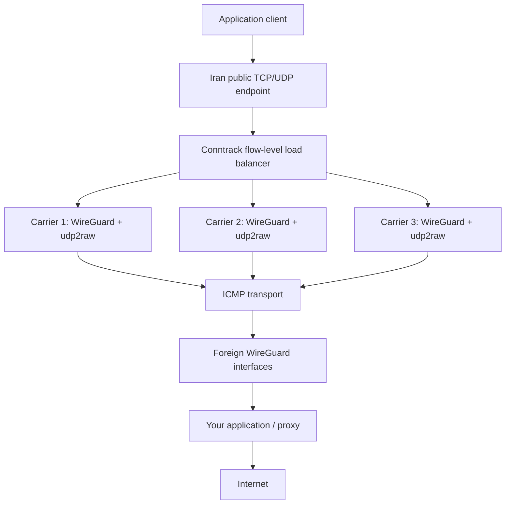

# Portable Multi-Carrier ICMP Tunnel Installer

Release 2 turns the production-proven **three parallel WireGuard-over-udp2raw ICMP carriers** into a portable installer for a pair of Linux servers. An Iran server accepts a public TCP/UDP application endpoint and forwards connections to the same application on a Foreign server. Conntrack keeps each TCP connection and UDP flow on one carrier.

**Validation:** the portable installer has static checks, unit tests, mocked installation/rollback tests, and offline dry-run verification. **Clean-host live installation has not been performed.** The historical architecture was production-proven; that is a separate claim. See [release validation](docs/validation.md).

This is a port relay. Install/configure your own application or proxy on the Foreign server; it must accept TCP and UDP on every Foreign WireGuard address (or `0.0.0.0`) at the configured application port. Application credentials are outside this project. The installer does not deploy Shadowsocks/Xray or turn arbitrary client packets into an Internet VPN.

## Architecture



WireGuard supplies encryption and peer authentication. udp2raw supplies ICMP transport; `xor/simple` is **not** the confidentiality boundary. MTU **900** and three carriers remain the tested defaults. See [architecture](docs/architecture.md) and [security](docs/security.md).

## Requirements and supported systems

- Ubuntu **22.04, 24.04, 26.04 LTS**; Debian **12 or 13**. These are explicit compatibility targets, not a claim of live testing on each distribution. [Ubuntu releases](https://releases.ubuntu.com/), [Debian releases](https://www.debian.org/releases/).
- `x86_64` or `aarch64`; Linux kernel >= 5.6 with WireGuard, BBR, fq, conntrack, NAT, statistic, u32 and TCPMSS features. Python 3, booted systemd, `iproute2`, apt, root and raw/PF_PACKET socket privileges. Restricted containers are unsupported.
- A physical IPv4 path between hosts; Foreign must have an externally reachable IPv4. Allow bidirectional ICMP Echo traffic in provider firewalls. NAT or middleboxes that rewrite ICMP identifiers may prevent pairing; direct public IPv4 is recommended.
- Working distribution repositories and HTTPS access to GitHub to build the pinned udp2raw revision. Packages are installed automatically after preflight; severely minimal hosts missing `ip`, apt or kernel modules get an actionable stop.
- Three usable CPUs recommended. With one or two CPUs the installer warns and shares valid CPU IDs; it keeps three carriers and never silently scales above three.
- An iptables or iptables-nft environment owned by one firewall manager. Active UFW/firewalld and independent nftables tables are refused to avoid conflicting persistence. The installer does not disable them or replace their policies.

## Install on the Foreign server

```bash
git clone https://github.com/Aminsadr854/iran-de-wg-tunnel.git
cd iran-de-wg-tunnel
git checkout v2.0.0
sudo ./install.sh
# Select 1: Foreign server; supply its reachable IPv4 and application port.
sudo tunnelctl export-peer /root/icmp-tunnel-peer.json
```

The installer handles packages, a pinned native udp2raw build, independent WireGuard identities and PSKs, strong random carrier secrets, interface addresses, systemd services, scoped firewall rules, sysctl tuning and the health timer. It displays preflight information before changing the host. No source editing is needed.

Configure your application to listen on all Foreign carrier IPs at `APPLICATION_PORT`, for TCP **and** UDP. The default addresses are `10.203.0.2`, `10.203.0.6`, `10.203.0.10`; `tunnelctl config` reports the selected network. Restrict direct public access to your application using your existing firewall if desired.

## Pair and install on the Iran server

`/root/icmp-tunnel-peer.json` is a **SECRET**, not a public configuration. It contains Iran private keys, PSKs and carrier secrets, but no Foreign private keys. Foreign generates Iran identities during bootstrap so there is no manual multi-key exchange or return trip. The Foreign owner therefore initially holds Iran's identity material; both servers must be trusted administrators of this pair.

Transfer through your existing authenticated SSH/SCP access. For example, run from Foreign if root SSH to Iran is already permitted:

```bash
sudo scp /root/icmp-tunnel-peer.json YOUR_IRAN_SSH_USER@IRAN_HOST:~/icmp-tunnel-peer.json
```

Otherwise use a trusted administrator workstation and your normal SSH accounts. Do not open root SSH or change SSH policy for this project. On Iran:

```bash
chmod 600 ~/icmp-tunnel-peer.json
git clone https://github.com/Aminsadr854/iran-de-wg-tunnel.git
cd iran-de-wg-tunnel
git checkout v2.0.0
sudo ./install.sh
# Select 2: Iran server; enter the absolute pairing file path.
sudo tunnelctl status
sudo tunnelctl health
```

A local physical address/interface is detected from the Foreign peer route. Iran exposes `PUBLIC_LISTEN_PORT` for TCP and UDP. Point clients at Iran's public address and that port, using **your application's** own protocol and credentials. After confirming both endpoints, remove transferred copies that you no longer need using your normal secure-file procedures. Foreign retains a protected export copy; manage secret backups deliberately.

## Automation and configuration

Public configuration is literal `KEY=value` data, **not a sourced shell script**. No quotes, expansions or command execution. Copy the example **outside the repository** and replace the documentation IPv4:

```bash
sudo cp config.example.env /root/tunnel-config.env
sudo nano /root/tunnel-config.env
sudo ./install.sh --role foreign --config /root/tunnel-config.env
# Iran imports the paired layout automatically:
sudo ./install.sh --role iran --peer /home/YOUR_USER/icmp-tunnel-peer.json
```

Iran may also use `--config` containing `ROLE=iran` and `PEER_FILE=/absolute/path`. Carrier addressing, ports, MTU and Foreign IP must match the pairing bundle; only local interface/CPU/health settings can differ. See [configuration reference](docs/configuration.md).

```bash
# Actual host preflight plus change preview; root needed; fails on incompatibility.
sudo ./install.sh --dry-run --role foreign --config /root/tunnel-config.env
# Offline generator preview; no claim that this host can install:
./install.sh --dry-run --offline --config config.example.env
./install.sh --dry-run --offline --role iran
```

Neither dry-run creates keys, interfaces, firewall rules, routes, services or sysctl changes. The offline variant skips host checks and is suitable for CI. Preflight checks OS, kernel, modules, systemd, CPUs/RAM, physical route/interface, privilege, occupied ports, existing routes/interfaces/configuration/units, firewall ownership and Internet connectivity. Carrier connectivity is verified by health after pairing.

## Ports and firewall requirements

| Resource | Default | Requirement |
| --- | --- | --- |
| Iran public application endpoint | TCP + UDP 9094 | Allow from intended application clients |
| Foreign application | TCP + UDP 9094 on carrier IPs | Application must listen on every carrier IP |
| Outer transport | ICMP Echo request/reply, IDs 42094–42096 | Allow in both provider/network firewalls; these are not public TCP listeners |
| Reserved raw socket ports | UDP 42094–42096 | Local udp2raw reservation; conflict checked |
| Foreign WireGuard | UDP 51894–51896 | Local udp2raw only; blocked on non-loopback INPUT |
| Iran WireGuard | UDP 52894–52896 | Local carrier only; blocked on non-loopback INPUT |
| Iran udp2raw loopback | UDP 53894–53896 | Bound to 127.0.0.1 |
| Installation downloads | outbound HTTPS + apt repository access | Packages and pinned source build |

ICMP has identifiers rather than TCP/UDP ports. Carrier identifiers and distinct secrets separate the three raw processes. Dedicated `IT2_*` chains suppress kernel Echo replies only for the reserved identifiers, admit project traffic, apply DNAT/SNAT and MSS clamping. Unrelated traffic returns to existing policies. No global firewall flush, default route replacement, policy routing of SSH or automatic firewall-manager disable occurs. Custom raw-table/iptables policy can still interfere; review existing policy and diagnostics.

## Management

Run management commands with sudo. `tunnelctl version` needs no root.

| Command | Purpose |
| --- | --- |
| `tunnelctl status` | Role/version, carrier service state, timestamps, RX/TX, MTU, endpoint, BBR |
| `tunnelctl health` | Independent peer probes, handshakes, routes, services, firewall, sysctl |
| `tunnelctl restart` | Sequential carrier restart |
| `tunnelctl restart-carrier 1` | Restart one carrier (1-based) |
| `tunnelctl repair` | Backup, preflight and transactional re-render of owned resources |
| `tunnelctl logs` | Bounded sanitized project journald entries |
| `tunnelctl diagnostics` | Non-secret diagnostic output; IPs/topology still included |
| `tunnelctl config` | Public configuration only |
| `tunnelctl version` | Single `VERSION` file |
| `tunnelctl export-peer /root/peer.json` | Export protected Foreign bootstrap bundle |
| `tunnelctl import-peer /path/to/peer.json` | Install Iran from protected bundle |
| `tunnelctl backup` | Protected backup outside Git, under `/var/lib/icmp-tunnel/backups` |
| `tunnelctl restore /path/to/backup.tar.gz` | Restore identities to an installed matching role/layout |
| `tunnelctl upgrade --source /path/to/checkout` | Preserve configuration/keys; backup then upgrade |
| `tunnelctl uninstall` | Remove project resources; retain secret backup by default |

For a protected diagnostic attachment:

```bash
sudo sh -c 'umask 077; tunnelctl diagnostics > /root/tunnel-diagnostics.txt'
```

Review IP addresses and topology before sharing. Raw udp2raw stdout/stderr are suppressed because upstream argument parsing can log secrets. Systemd lifecycle records, interface counters, exit states and health results remain available through the CLI. Logging is bounded through journald; there are no accumulating application log files.

Health runs every minute with jitter. Self-healing is off by default; set `SELF_HEAL=yes` before install to enable it. Recovery requires at least three consecutive failures by default, observes a 300-second per-carrier cooldown, restarts at most one carrier per run, and caps attempts at three per carrier per hour. Missing shared firewall/sysctl state prevents automatic carrier restarts. Lost peer connectivity is not proof that a local restart can fix the path. Existing flows on a dead carrier can fail; new-flow failover is not implemented.

## Upgrade, backup, restore and uninstall

Update a trusted checkout, then run:

```bash
git switch main
git pull --ff-only
sudo ./install.sh --upgrade
# Or: sudo tunnelctl upgrade --source "$PWD"
```

The Release 2 same-major upgrade path makes a secret backup and a root-only executable/configuration snapshot before stopping the new installation's services. It preserves identities and settings and restores the snapshot if applying the update fails. The pinned transport binary is retained. Network downtime is expected during repair/upgrade/restore. Major version migrations require explicit migration support. Existing Release 1/production deployments are not automatically adopted; use fresh hosts. Do not run this on the author's production servers.

```bash
sudo tunnelctl backup /root/tunnel-backup.tar.gz
sudo tunnelctl restore /root/tunnel-backup.tar.gz
sudo tunnelctl uninstall
# Unattended, retain backup:
sudo ./uninstall.sh --yes
# Explicitly discard current configuration instead of making another backup:
sudo ./uninstall.sh --yes --delete-secrets
```

Restore validates bounded, whitelisted archive members without extracting user-controlled paths. It requires an installed matching public configuration; install the same role/layout on a replacement host first, then restore and pair its counterpart. A backup does not restore arbitrary distribution/firewall state. Backups contain secrets and remain outside Git. Uninstall never implicitly removes existing backups or distro packages.

Failed new installation removes owned interfaces/units/rules/configuration and conditionally restores original sysctl values. Package installation and shared kernel module loading are not reversed. Sysctl restoration skips values changed independently after installation. Transactions record state before applying changes; a power loss/SIGKILL can require manual recovery from the recorded snapshot or backup. See [operations](docs/operations.md).

## Performance reference

| Historical sustained benchmark | Result |
| --- | --- |
| 60 seconds | 129.24 Mbps |
| 5 minutes | 113.97 Mbps |
| 10 minutes | 120.51 Mbps |

These are user-supplied **production reference measurements**, not portable-installer test results or guarantees. CPU, provider ICMP handling, routing, RTT, loss, virtualization and network conditions dominate performance. A single flow uses a single carrier; aggregate parallel-flow throughput can exceed that of one raw process. Keep MTU 900 unless intentionally testing alternatives. BBR/fq and socket tuning are installed without automatic aggressive MTU/performance experiments. [Historical benchmark notes](docs/history/benchmarks.md).

## Troubleshooting and limitations

Start with `sudo tunnelctl status`, `sudo tunnelctl health`, and `sudo tunnelctl diagnostics`. [Troubleshooting](docs/troubleshooting.md) covers absent handshakes, blocked ICMP, service/port conflicts, UDP/DNS failures, high CPU/RTT, MTU and reboot issues.

- IPv4 only. The endpoint relays one configured application port; application-level DNS/Internet behavior belongs to your proxy.
- One installation/pair per host. No transparent failover of established flows and no active carrier withdrawal.
- ICMP filtering, identifier rewriting or unusual host firewall policy can prevent operation. This is neither undetectable nor unblockable.
- Sysctl tuning affects the host globally; original values are saved and conditionally restored.
- Native source build needs RAM/disk and access to distribution repositories; very small VPSs may need additional build resources.
- Root on either endpoint can access bootstrap secrets. Protect hosts, transferred files and backups.

## FAQ

**Does the installer configure Internet access for my application?** It connects the Iran port to your Foreign application's matching TCP/UDP listener. Your application handles Internet access and client authentication.

**Does XOR encrypt my traffic securely?** WireGuard provides the cryptographic security. udp2raw `xor/simple` provides only the carrier layer.

**Will I get 100+ Mbps?** No guarantee. The reference benchmarks were on particular production hosts.

**Can I use fewer CPUs?** Yes; three processes safely share available CPU IDs with a warning. Additional carriers require an explicit `CARRIER_COUNT` change before pairing and are experimental.

**Can I rerun installation?** It detects existing state and stops with repair/upgrade instructions. It does not regenerate identities or add duplicate rules.

**Can I use UFW/nftables?** iptables-nft is a supported target. Active independent firewall managers/tables require a deliberate persistent integration; this release refuses them and leaves them unchanged.

## Development and licensing

```bash
./tests/run.sh
```

Tests need Python 3; install ShellCheck for shell analysis and `wireguard-tools` to exercise real key generation. Pure generators and lifecycle mocks never deploy to production. Source layout: Bash entry points, `lib/tunnel/{config,render,host,manager}.py`, `scripts/tunnelctl.py`, `tests/`, and `docs/`. [Changelog](CHANGELOG.md), [security audit](docs/security-audit.md).

No LICENSE existed in the original repository. No license has been invented or changed; owner selection remains pending. See [license status](docs/license-status.md). Third-party udp2raw retains its own upstream license and is downloaded/built rather than vendored.
